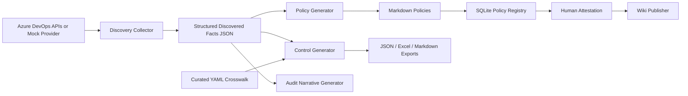

# AI-SOC2-Policy-Copilot

`soc2-copilot` is a production-style Python MVP that discovers Azure DevOps evidence, generates grounded SOC 2 policy drafts and control statements, records human attestation in SQLite, and publishes only approved content to Azure DevOps Wiki.

The design goal is simple: policy text should describe operational reality, not fantasy. Every generated artifact separates observed evidence from required practice and treats AI output as a draft until a named reviewer attests it.

## Why This Matters

Security leaders are often forced to reconcile three different truths:

- what engineering systems actually enforce
- what policy documents claim
- what auditors need to see

This project narrows that gap by using Azure DevOps discovery as the source of truth, curated compliance mappings on disk, and explicit human approval gates before publication.

## Architecture



## Key Capabilities

- Azure DevOps discovery with real and mock providers
- Markdown policy generation for five policy families
- SOC 2 control statement generation for selected Trust Services Criteria
- Curated SOC 2 to ISO 27001 crosswalk loaded from YAML
- SQLite-backed policy registration and attestation workflow
- Azure DevOps Wiki publishing with attestation and integrity checks
- Audit narrative generation for a given reporting period

## Repository Layout

```text
.
├── data/
├── output/
├── templates/
├── src/soc2_copilot/
└── tests/
```

## Setup

### 1. Create a virtual environment

```bash
python3.11 -m venv .venv
source .venv/bin/activate
pip install -e .[dev]
```

### 2. Configure environment variables

```bash
cp .env.example .env
```

Populate the values for Azure DevOps and Azure OpenAI. The CLI can still run in `mock` mode without live credentials.

## Environment Variables

| Variable | Purpose |
| --- | --- |
| `AZURE_DEVOPS_ORG` | Azure DevOps organization URL |
| `AZURE_DEVOPS_PAT` | Azure DevOps personal access token |
| `AZURE_DEVOPS_PROJECT` | Default Azure DevOps project |
| `AZURE_DEVOPS_WIKI_ID` | Target Azure DevOps wiki identifier |
| `AZURE_OPENAI_ENDPOINT` | Azure OpenAI resource endpoint |
| `AZURE_OPENAI_KEY` | Azure OpenAI API key |
| `AZURE_OPENAI_DEPLOYMENT` | Azure OpenAI deployment name |
| `AZURE_OPENAI_API_VERSION` | Azure OpenAI API version |
| `CISO_ASSISTANT_URL` | Optional CISO Assistant API base URL |
| `CISO_ASSISTANT_API_KEY` | Optional CISO Assistant API key |
| `CISO_ASSESSMENT_ID` | Optional assessment identifier |
| `COPILOT_DB_PATH` | SQLite database path |
| `OUTPUT_DIR` | Default output directory |
| `LOG_LEVEL` | Log level for CLI execution |

## Usage

### Discover facts

```bash
soc2-copilot discover \
  --org https://dev.azure.com/yourcompany \
  --project ProjectA \
  --mode mock \
  --output ./output/discovered_facts.json
```

### Generate policies

```bash
soc2-copilot generate-policies \
  --facts ./output/discovered_facts.json \
  --types all \
  --output ./output/policies
```

### Generate controls

```bash
soc2-copilot generate-controls \
  --facts ./output/discovered_facts.json \
  --criteria all \
  --output ./output/controls.json
```

### Export the curated crosswalk

```bash
soc2-copilot crosswalk \
  --format excel \
  --output ./output/crosswalk.xlsx
```

### Attest a generated policy

```bash
soc2-copilot attest \
  --policy ./output/policies/access_control_policy.md \
  --attested-by "Jane Smith" \
  --role "Security Manager" \
  --next-review-date 2025-12-31
```

### Publish to Azure DevOps Wiki

```bash
soc2-copilot publish-wiki \
  --policy access_control_policy \
  --wiki-id YOUR_WIKI_ID
```

### Generate audit narratives

```bash
soc2-copilot audit-narratives \
  --facts ./output/discovered_facts.json \
  --period "Q2 2025" \
  --output ./output/audit_narratives.md
```

### Launch the Streamlit web app

```bash
./start.sh
```

The launcher bootstraps the local `venv` when needed, clears Python and Streamlit caches, and starts `ui.py` on `http://localhost:8501`.

## Discovery Flow

The discovery collector supports two modes:

- `mock`: returns realistic sample evidence for demos, local testing, and architecture walkthroughs
- `real`: calls Azure DevOps REST APIs through a best-effort client abstraction

Collected evidence is normalized into typed models such as branch policy facts, pipeline gate facts, PR statistics, security group facts, scanning indicators, and service hooks.

## Generation Flow

Policy, control, and narrative generation follow the same guardrails:

- discovered facts remain structured and separate from generated text
- generated content includes an AI-assisted draft disclaimer
- missing evidence becomes a requirement statement, not an invented implementation claim
- optional Azure OpenAI integration enhances drafts but falls back to deterministic templates when unavailable

## Attestation Workflow

1. A generated policy is written to Markdown and registered in SQLite.
2. The policy file hash is stored using SHA-256.
3. A named approver attests the specific content hash.
4. Publishing is refused if the file changes after attestation.
5. The CLI can show a diff against the previous version when one exists.

## Publish Workflow

Only approved policies with an attestation whose content hash matches the current file are publishable. The wiki publisher prepends metadata for:

- version
- attestation status
- attested by
- attested date
- next review date

## Streamlit UI

The Streamlit app provides a demo-friendly web front end for:

- running Azure DevOps discovery in mock or real mode
- viewing discovered facts and evidence summaries
- generating policies, controls, crosswalk exports, and audit narratives
- previewing generated Markdown artifacts
- recording human attestation for generated policies

This is suitable for internal demos and early stakeholder review. If the project later becomes a broader Azure-hosted product, the existing service modules can also be surfaced through FastAPI or a more traditional web UI without discarding the current code.

## Sample Outputs

- `output/discovered_facts.json`
- `output/policies/*.md`
- `output/controls.json`
- `output/crosswalk.xlsx`
- `output/audit_narratives.md`

## Security Considerations

- secrets are loaded only from environment variables
- PATs and API keys are never written to output artifacts
- content integrity uses SHA-256 hashing
- publication requires explicit human attestation
- the real Azure DevOps client degrades gracefully when endpoints are unavailable

## Limitations

- Azure DevOps APIs differ by licensing level and enabled services; some real-mode calls are best effort
- Azure OpenAI output quality depends on the deployment and prompt compliance
- the CISO Assistant integration is intentionally lightweight and should be adapted to the target API contract
- PDF export is a stub extension point and not enabled by default

## Future Roadmap

- richer repo and pipeline YAML parsing
- UI for approvals and evidence review
- scheduled rediscovery and policy refresh
- Git-backed version promotion workflows
- additional compliance frameworks beyond SOC 2 and ISO 27001
